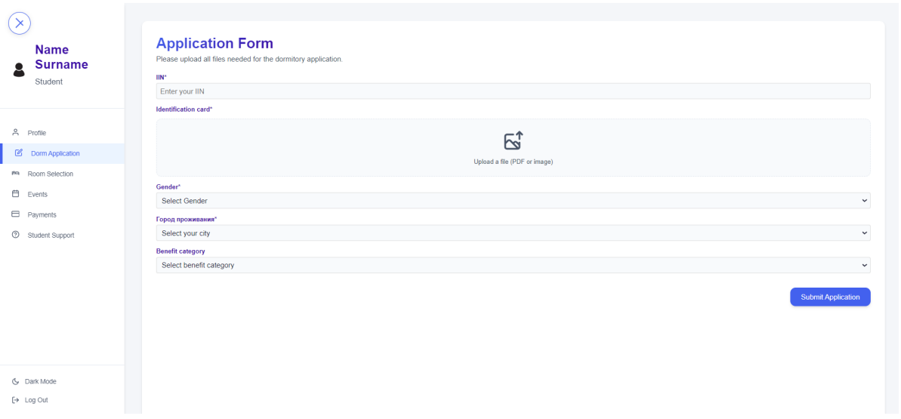
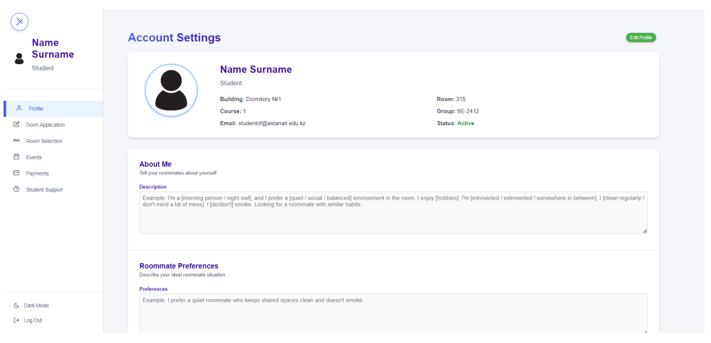
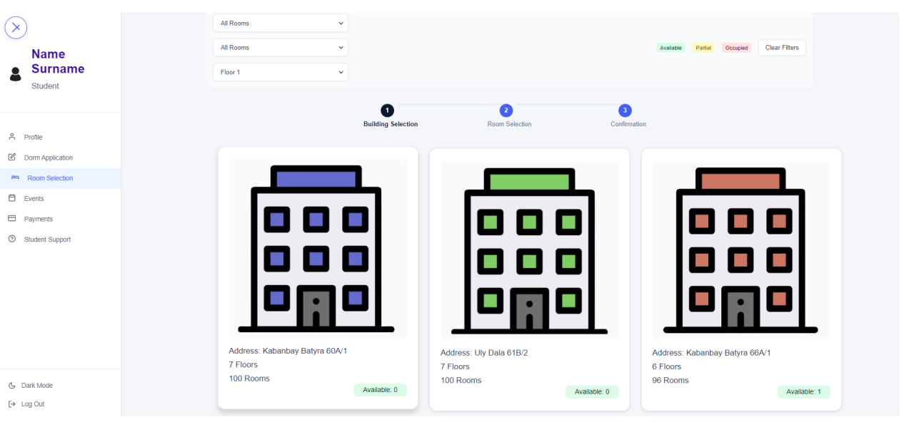
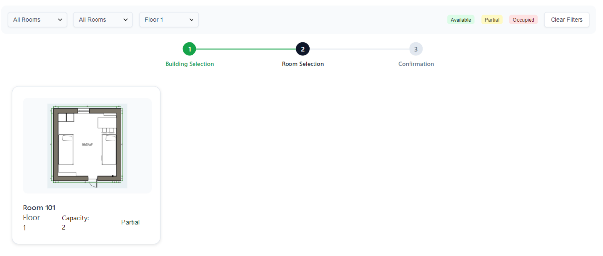
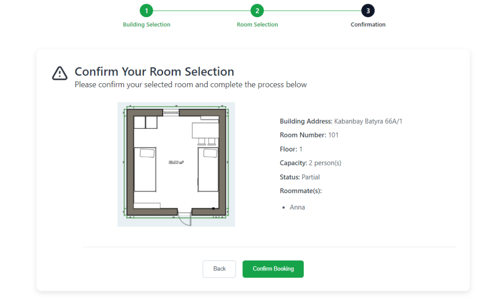
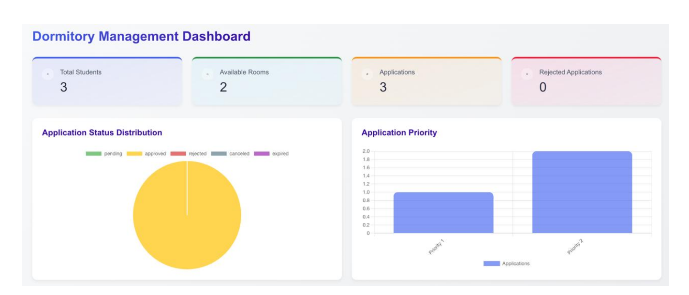

# 📄 README


# DormEase – Data-Driven Dormitory Management System

DormEase is a full-stack web application designed to automate student dormitory settlement processes, with a strong focus on data collection, analysis, and process optimization.

The system transforms manual workflows into structured digital pipelines, enabling better decision-making and improving operational efficiency.

---

## 🎯 Project Focus

This project is not only a web application, but also a **data-driven system** that:

- collects structured user and process data
- identifies bottlenecks in dormitory workflows
- supports analysis of student behavior and satisfaction
- enables future data-driven decision-making

---

## 📊 Data Perspective

The system was designed with data generation and analysis in mind:

## Data Collected:

- student application data
- room selection preferences
- contract processing times
- user interaction events
- support requests

## Analytical Insights (from research phase):

- high student fatigue caused by administrative barriers
- contract verification is the main bottleneck
- lack of automation leads to delays and poor communication
- low perceived control affects student satisfaction

---

## 🧠 Data Pipeline (Conceptual)

User Actions (Frontend)
↓
Backend API (Django)
↓
Event / Task Queue (RabbitMQ, Redis)
↓
Background Processing (Celery)
↓
Storage (Database + MinIO)
↓
Potential Analytics Layer

---

## ⚙️ Tech Stack

- Python / Django (data processing & API)
- React (data input interface)
- Celery (asynchronous data processing)
- RabbitMQ (message queue)
- Redis (cache & fast data access)
- MinIO (object storage)
- Docker Compose (system orchestration)

---

## 🔍 Key Data-Oriented Features

- Structured data collection via application workflows
- Event-driven architecture for processing user actions
- Background processing for heavy operations (e.g., contract validation)
- Centralized storage for documents and metadata
- Designed for scalability and future analytics integration

---

## 📈 Research & Analysis

The project includes a research phase with:

- survey data from 100+ students
- interviews with administrative staff
- statistical and qualitative analysis

### Key findings:
- administrative inefficiencies significantly impact user experience
- automation improves process transparency and speed
- data-driven insights can improve room allocation and satisfaction

---

## 📸 Screenshots







.png)

---

## 🚀 Running Locally

```bash
docker-compose -f docker-compose.prod.yml up --build
````

---

## 🔮 Future Data Work

- AI-based roommate matching (recommendation system)
- predictive analytics for application load
- anomaly detection in applications and contracts
- integration with BI tools (dashboards, reporting)

---

## 💡 Why This Project Matters

This project demonstrates:

- data-aware system design
- building data pipelines within web applications
- working with distributed systems (queues, async processing)
- transforming raw user interactions into structured data

---

## 👩‍💻 Authors

- Darya Kachurovskaya
- Aigerim Omirzak
- Zharkynai Zhakuda

